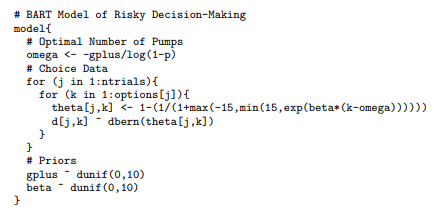

# 2Parameter_Model_In_BART

Balloon Analogue Risk Task(BART) is a widely used measure of risk-taking dendency in human.

For each trial of the task, participants get two options.

1. Stop the pump and secure the amount of money of the current balloon.
2. The other is to take the risk to pump balloon, resulting in larger balloon(more reward) or exploded balloons.  

## Model Explain

## Requirement

- numpy >= 1.17.2
- PyMC3 >=3.9.2

## Reference
- Bayesian Cognitive Modeling(Cambridge University Press, 2014) 
https://www.cambridge.org/core/books/bayesian-cognitive-modeling/bart-model-of-risk-taking/A6249E1FFA080064C986B871D57D03B8
- Cognitive model decomposition of the BART: Assessment and application(Don van Ravenzwaaij, Gilles Dutilh, Eric-Jan, Wagenmakers, Journal of Mathematical Psychology
Volume 55, Issue 1, February 2011, Pages 94-105)  https://www.sciencedirect.com/science/article/pii/S0022249610001112
